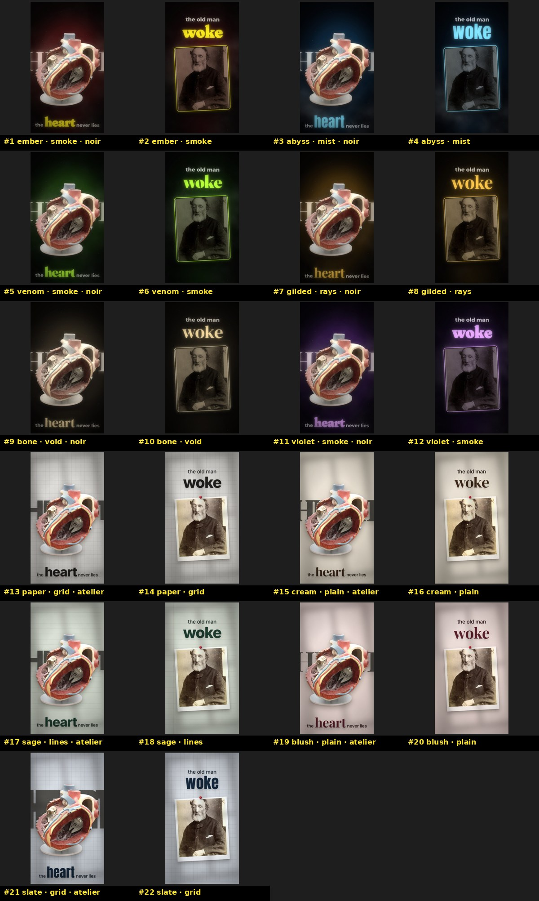

# Story Video Studio

**An AI-agent-driven motion-design studio for faceless story videos.** Give it a story — a public-domain
classic, a legend, a true mystery — and your AI agent (Codex, Claude Code, Cursor…) turns it into a
finished vertical video for TikTok / Reels / Shorts: human-sounding narration, kinetic typography typed on
word by word as it is spoken, images that show exactly what is being said, film texture, transitions and
sound design, mastered and ready to post.



The agent writes and chooses; the studio's **locked templates** do the design, timing, mixing and
rendering — so every video looks edited by a meticulous human, and the agent has no room to be sloppy.

## What it does
- **Story → script** that hooks in the first second (retention structure, open loops, a payoff that loops).
- **Narration** with Google Gemini TTS (free tier): 30 voices cast by story type, performance tags
  (`[whispering]`, `[extremely fast]`…), editor-style pause tightening, and an automatic check that the
  voice said *exactly* the script (re-takes if not).
- **Word-exact sync**: WhisperX forced alignment; every word appears when it is spoken, accent words type on
  across their duration, images land on the word that names them, sounds hit on their word.
- **Images that fit the line** — found: museums (Met, Cleveland, Art Institute, Smithsonian), Wikimedia,
  Openverse, Pexels, Pixabay, Unsplash; ranked with CLIP, background removed with BiRefNet, one object
  selected out of a busy photo with GroundingDINO, exposure-matched and graded. Found first, even for
  fiction; an agent with its own image tool (e.g. Codex `$imagegen`) generates only an essential visual no
  existing image can show (reason recorded), in one art direction, passing an anti-slop checklist.
  Framing is checked in the actual render, through zooms and camera moves: no cut-off heads, hands or
  objects. Every image gets a written verdict; characters are always anonymous, never famous faces; no
  image is ever reused in a video.
- **Looks**: 2 layout families × 11 colour themes × 7 moving backdrops, 14 scene templates.
- **Sound**: ~140 CC0 effects + music beds, auto-placed on cuts and words, ducked under the voice,
  silence as an effect, mastered to -14 LUFS.
- **Memory**: a private story log so no story, look or narrator is repeated.

## How it works — one folder per video, one step at a time
| # | Step | Who | Output |
|---|---|---|---|
| 0 | pick a story + look (theme ≠ last two videos) | agent | `episodes/<slug>/` |
| 1 | script: hook, beats, exact spoken words | agent | `01-script/` |
| 2 | voice: cast, direct, narrate, verify 100 % | agent + Gemini | `02-voice/narration.wav` |
| 3 | timing: every word's start/end | studio | `03-timing/words.json` |
| 4 | edit: per scene — template, emphasis, image brief, sounds | agent | `04-edit/edit.json` |
| 5 | images: found / generated, **looked at**, verdict per image | agent + studio | `05-assets/` |
| 6 | sound: story cues + ambience (the rest is automatic) | agent + studio | in `edit.json` |
| 7 | render: stills → preview → director's scorecard → final | studio + agent | `06-render/final.mp4` |

The agent follows [`AGENTS.md`](AGENTS.md) and the numbered skills in [`skills/`](skills/) (00 → 08), and
reads [`skills/KNOWN-MISTAKES.md`](skills/KNOWN-MISTAKES.md) first. `./sv go <slug>` runs every mechanical
step and stops at each creative or review checkpoint with the exact next command.

## Quick start
**Requirements**: Node 20+, Python 3.10–3.13 (3.12 recommended), ffmpeg, git. Linux or macOS (Windows: WSL).
~8 GB disk (Python ML packages + models, downloaded once). A GPU is optional.

```bash
git clone https://github.com/ilyass-oa/story-video-studio.git && cd story-video-studio
./sv setup     # engine, Python env, textures, sound banks, your private history log, config/secrets.env
```
Open **`config/secrets.env`** and paste your keys — the file explains each one, where to get it (all free)
and which are optional. Only `GEMINI_API_KEY` is required (narration); `PEXELS_API_KEY` is recommended.
```bash
./sv doctor    # ✓ for everything that works
```

## Make a video
**With an AI agent** — open the folder in Codex / Claude Code / Cursor and say:
> **`start`** — the agent follows [`START.md`](START.md): hunts a public-domain story with a wow twist that
> was never made before, writes it, casts the voice, builds every scene and renders the final video.
> (`start scary`, `start true fact`, `start atelier`… narrow the hunt.)

Or be specific: *"Make a noir video about the Mary Celeste, abyss theme, female narrator."*

**By hand**
```bash
./sv looks                                   # the themes, with pictures
./sv new my-story --title "My Story" --source "Author (year), public domain" --pack noir --theme abyss
#  write episodes/my-story/01-script/script.txt (the spoken words)
./sv go my-story         # voice → timing → scene draft; fill 04-edit/edit.json (skills/04)
./sv go my-story         # images → look at 05-assets/review.jpg, write verdicts → stills
./sv render my-story --final
```
`./sv status <slug>` always says where you are and what comes next. `./sv help` lists every command.

## Project structure
```
AGENTS.md            start here (agents) — the rules, the pipeline, the standard
START.md             the "start" prompt: new story hunt → finished video, autonomously
README.md  sv        this file · the only command you need (./sv help)
config/              studio.json (defaults) · voices.json (30 narrators) · secrets.example.env (keys rubric)
skills/              00-story-director → 08-bank-builder, in pipeline order · KNOWN-MISTAKES.md · _library/
engine/              Remotion renderer · src/templates/catalog.json (14 templates) · src/looks.json (themes)
                     gallery/ (what every template and theme looks like)
banks/               sfx/ · music/ · images/ · devices/ · textures/ — indexed, licensed (CREDITS.md)
tools/               sv.mjs + lib/ (pipeline, Node) · py/ (image AI, audio, alignment)
episodes/<slug>/     01-script → 02-voice → 03-timing → 04-edit → 05-assets → 06-render   (local)
history/             STORIES.md (your story log + backlog) · videos/ (your finals)             (local)
```

## Your data stays yours
Git ignores your keys (`config/secrets.env`), your episodes, your history and finished videos, your
references, the Python env and the downloaded models. The repository contains only the studio.

## Licences
- **Code**: MIT (see [`LICENSE`](LICENSE)).
- **Render engine**: [Remotion](https://www.remotion.dev/license) has its own licence — free for
  individuals, non-profits and companies of up to 3 people; larger companies need a Remotion company licence.
- **Bank media** keeps its own licence (CC0, public domain, CC BY, CC BY-SA), recorded in each
  `banks/*/index.json` and listed in [`banks/CREDITS.md`](banks/CREDITS.md). `./sv credits <slug>` writes
  the attributions one video needs for its post description.
- **Fonts** (bundled via @fontsource): SIL Open Font License (Special Elite: Apache-2.0).
- **Models** (downloaded automatically on first use): CLIP (MIT), GroundingDINO (Apache-2.0), BiRefNet via rembg (MIT),
  faster-whisper (MIT), WhisperX (BSD-2-Clause), wav2vec2 alignment models (their own licences).
- **Services**: Gemini API and each image/sound source are used under their own terms. You are
  responsible for the stories, images and voices you publish (including disclosure of AI-generated media
  where a platform requires it).

## Contributing
New templates, themes, backdrops, sounds or tools: read [`skills/08-bank-builder`](skills/08-bank-builder/SKILL.md)
(render every template in every look before proposing it). Found a failure mode while making a video?
Add it to [`skills/KNOWN-MISTAKES.md`](skills/KNOWN-MISTAKES.md) with the fix — that file is how every
agent learns.
